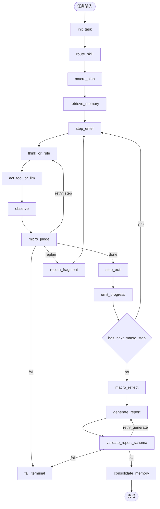

# 需求分析（修订版）：LangGraph 接入 · 垂直智能体 Plan-and-Execute 混合 Loop

> 版本：v0.2 · 2026-07-22  
> 范围：M1 — 用 LangGraph 替换 FastAPI mock runner，建立可观测、可恢复、可扩展的垂直 Loop  
> 前置：M0 已完成（React + FastAPI + mock 报告）  
> 关联：`docs/spec-douyin-keyword-agent.md`、`skills/douyin-keyword-research/SKILL.md`

---

## 0. 外部基准审查结论（针对“3步/3轮不够”）

基于行业公开实践（企业 Agent 架构、LangGraph 循环控制、耐久编排/审批模式）得到三条硬结论：

1. **垂直场景的主耗时在集成和恢复，不在 LLM 推理本身。**  
2. **Loop 不应使用固定“小上限”，应使用“分层预算 + 自适应扩展 + 保险丝上限”。**  
3. **终止控制必须代码化，不可交给 LLM 自己决定。**

因此，本版将 `max_micro_loops_per_step=3` 从默认策略调整为：
- **默认预算 3**
- **可扩展到 8~12（受预算、质量门、阶段 SLO 约束）**
- **全局 recursion/cost/time 三重保险丝**

---

## 1. 目标与边界

### 1.1 目标

建立真实 Agent Loop，使 React 看到的进度与 LangGraph 执行一致，并支持：
- 长任务（非固定 8 秒）
- 步内重试与重规划
- 可审计失败原因
- 稳定的结构化报告输出

### 1.2 非目标（M1 仍不做）

- 真实 DouyinDataMCP 采集（M2）
- 多租户与权限体系
- 向量知识库正式入库
- SSE/WebSocket（M1 仍轮询）

---

## 2. Loop 策略升级：从“固定上限”到“分层预算”

### 2.1 三层循环模型

```
L0 Macro Workflow（运营可见）
  采集 -> 扩展 -> 打分 -> 报告

L1 Step Micro Loop（技术可见）
  think -> act -> observe -> judge (同一Macro步内)

L2 Replan Loop（仅失败触发）
  revise_plan_fragment -> 回到对应Macro步
```

### 2.2 预算控制（核心修订）

| 层级 | 控制项 | 默认 | 可扩展 | 硬上限 | 触发扩展条件 |
|---|---|---:|---:|---:|---|
| L1 micro/step | `micro_budget_default` | 3 | 8 | 12 | 工具可恢复错误、质量接近阈值 |
| L2 replan/step | `replan_budget_default` | 1 | 2 | 3 | 替代工具存在且历史成功率>阈值 |
| 全局 run | `global_loop_budget` | 30 | - | 60 | 管理员策略 |
| 全局时间 | `run_timeout_s` | 120 | - | 300 | 管理员策略 |
| 全局成本 | `run_token_budget` | 40k | - | 100k | 管理员策略 |

### 2.3 为什么不能写死 3

“3”只适用于轻量 Demo。垂直业务中常见场景：
- API 限流重试（指数退避）
- 跨源校验（A 源缺失需回退 B 源）
- 低质量结果二次收敛（评分接近阈值）

所以 M1 必须支持 **策略化扩展**，不是直接把数字改成 10。

---

## 3. LangGraph 图需求（v0.2）



---

## 4. 状态模型（必须新增）

在现有 `AgentState` 基础上新增预算与判定字段：

```python
# 预算与SLO
micro_budget_default: int
micro_budget_current: int
micro_budget_used: int
replan_budget_default: int
replan_budget_used: int
global_loop_budget: int
global_loop_used: int
run_timeout_s: int
run_started_at: float
run_token_budget: int
run_token_used: int

# 质量门
quality_score: float | None
quality_threshold: float
consecutive_no_gain: int
last_gain_delta: float | None

# 可观测
failure_class: str | None   # transient/permanent/policy/schema
events: list[dict]
```

---

## 5. 自适应扩展规则（替代写死循环次数）

### 5.1 Micro 扩展判定

满足以下全部条件时，允许把 `micro_budget_current` 从 3 提升到 6/8：
1. 错误分类为 `transient`（限流、超时、临时空返回）
2. 最近两轮质量增益 `last_gain_delta > min_gain_delta`
3. 未触及 `run_timeout_s` 与 `run_token_budget`
4. 当前 Macro 步属于允许扩展的步骤（collect/expand）

否则立即终止该步并进入 replan/fail。

### 5.2 必停条件（保险丝）

任一满足即强制终止：
- `global_loop_used >= global_loop_budget`
- 执行时长超 `run_timeout_s`
- token 超 `run_token_budget`
- `consecutive_no_gain >= 2`（连续两轮无有效增益）
- 命中 `policy`/`schema` 不可恢复错误

### 5.3 LLM 不负责计数

循环终止完全由代码路由器判定；LLM 只提供候选 action，不拥有终止权。

---

## 6. 错误分类与恢复策略（新增硬约束）

| 错误类 | 示例 | 可重试 | 动作 |
|---|---|---|---|
| transient | 429/超时/网络抖动 | 是 | 步内重试（指数退避） |
| data_gap | 字段缺失/样本不足 | 条件性 | replan 换源或降级策略 |
| schema | 输出不符合 Pydantic | 限次 | generate 重试 1~2 次 |
| policy | 越权工具/禁用操作 | 否 | 立即 fail |
| permanent | 参数非法/资源不存在 | 否 | fail + 人话提示 |

必须记录：`error_code`、`failure_class`、`node`、`tool`、`attempt`、`elapsed_ms`。

---

## 7. FastAPI 集成修订

### 7.1 运行方式

- `POST /api/tasks`：创建任务并后台触发 `run_langgraph_task`
- `run_langgraph_task`：`graph.invoke(initial_state, config={thread_id})`
- `GET /api/tasks/{id}`：从 `graph.get_state(thread_id)` 映射实时进度

### 7.2 新增响应字段（给前端）

```json
{
  "progress": {
    "step": 2,
    "step_name": "扩展联想词",
    "percent": 41,
    "micro_attempt": 4,
    "micro_budget": 8,
    "replan_used": 1
  }
}
```

说明：运营看到的是“正在努力修复”，而不是卡死。

---

## 8. React 需求修订

前端新增两处可视化，不暴露技术细节：

1. **进度细节条（简洁）**：  
   `步骤 2/4 · 子尝试 4/8 · 已重规划 1 次`
2. **温和提示文案**：  
   `数据源响应较慢，系统正在自动重试，预计 30~60 秒。`

禁止展示 raw 错误栈与 tool payload。

---

## 9. LLM 与 MCP 分工（v0.2）

| 阶段 | LLM | MCP | 备注 |
|---|---|---|---|
| collect | 否（规则路由） | 是 | 以工具为主 |
| expand | 低（可选） | 是 | 以工具为主 |
| score | 是（结构化） | 否 | JSON 输出 |
| report | 是（可合并） | 否 | 必须 schema 校验 |
| replan | 可选（建议规则优先） | 否 | M1 可规则化 |

---

## 10. M1 验收标准（升级版）

- [ ] 同一任务在“慢数据源”条件下可超过 3 次 micro 尝试并成功收敛  
- [ ] 遇到连续无增益时自动停止，不会无限循环  
- [ ] 命中硬预算（time/token/global loop）时确定性终止并给中文原因  
- [ ] API 返回 `micro_attempt/micro_budget/replan_used`  
- [ ] 报告输出始终通过 `TaskReport` 校验  
- [ ] 失败后 `dead_ends` 带错误分类和恢复路径  
- [ ] `recursion_limit` 作为兜底已配置并测试 `GraphRecursionError` 分支  

---

## 11. 参数初始建议（可直接落地）

```yaml
micro_budget_default: 3
micro_budget_max: 12
replan_budget_default: 1
replan_budget_max: 3
global_loop_budget: 40
run_timeout_s: 180
run_token_budget: 50000
quality_threshold: 0.75
min_gain_delta: 0.05
max_consecutive_no_gain: 2
```

---

## 12. 待确认决策（更新）

| ID | 决策项 | 推荐 |
|---|---|---|
| D1 | score 与 report 是否合并调用 | 合并（省 token），保留独立校验 |
| D2 | M1 是否开启 LangSmith | 开启（若 key 存在） |
| D3 | M1 checkpointer | MemorySaver；M1.5 切 SQLite |
| D4 | replan 由 LLM 还是规则 | M1 规则优先，LLM 仅建议 |
| D5 | micro 预算是否按步骤差异化 | 是：collect/expand 高，score/report 低 |
| D6 | 是否启用时间/成本双预算 | 是，必须 |

---

## 13. 一句话结论

本项目的 loop 不再是“每步最多 3 次”的 Demo 约束，而是“**四步宏流程确定 + 步内自适应扩展 + 三重保险丝终止 + 失败可解释可恢复**”的生产型垂直 Agent 运行机制。
