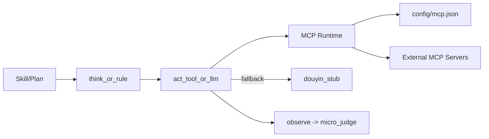

# Spec：Skill / Tool Use / MCP 运行时接入（M1.1）

> 版本：v0.1 · 2026-07-22  
> 目标：把当前“Skill + stub”执行链升级为“Skill + MCP 动态工具调用”，支持后续前端化管理 MCP 服务。

---

## 1. 背景与问题

当前 `agent-platform` 已具备：

- Skill 剧本层（`skills/*/SKILL.md`）
- LangGraph 执行图（`src/agent/graph.py`）
- MCP 配置位（`config/mcp.json`）

但关键短板是：

1. `act` 节点仍硬编码调用 `douyin_stub`；
2. `config/mcp.json` 未真正驱动工具调用；
3. 报告可在 stub 数据下“结构化通过”，存在结果可信性风险。

---

## 2. 范围（M1.1）

### In Scope

- 新增 MCP runtime 加载器，按 tool 名调用 MCP 工具；
- `act` 节点切换为“优先 MCP，按配置降级 stub”；
- 在返回数据中写入 `_meta.source` 标识（`mcp` / `stub_fallback` / `stub`）；
- 环境变量开关控制 MCP 行为；
- 保持 API/前端契约不破坏（兼容现有页面）。

### Out of Scope

- 前端 MCP 服务管理页（新增/编辑/删除 server）；
- 工具参数 schema 自动推断与表单生成；
- 多租户/权限隔离；
- MCP 健康探测面板。

---

## 3. 目标架构



---

## 4. 数据与执行约定

### 4.1 Tool Action 约定

- 形如：`tool:<tool_name>`
- `think_or_rule` 负责动作字符串生成；
- `act_tool_or_llm` 负责参数构造和执行。

### 4.2 返回数据标识

每个工具返回 payload 写入：

```json
{
  "_meta": {
    "source": "mcp|stub_fallback|stub",
    "tool": "tool_name",
    "mcp_error": "optional"
  }
}
```

用于前端和审计判断结果可信度。

---

## 5. 配置项

`.env` 新增：

- `MCP_RUNTIME_ENABLED=true|false`
- `MCP_ALLOW_STUB_FALLBACK=true|false`

行为：

- `enabled=true` 且 MCP 调用成功：使用 MCP 结果；
- `enabled=true` 且失败：
  - `fallback=true`：降级 stub；
  - `fallback=false`：直接失败，进入重试/重规划/失败路由；
- `enabled=false`：维持纯 stub 行为（开发模式）。

---

## 6. 实施步骤

1. 新增 `src/agent/tools/mcp_runtime.py`
   - 读取 `settings.mcp_config_path`
   - 懒加载 MCP client 与 tools
   - 提供 `invoke(tool_name, args)` 与错误封装

2. 改造 `src/agent/nodes/act.py`
   - collect / expand 分支走 `_invoke_tool_with_fallback`
   - 返回 payload 注入 `_meta`

3. 扩展 `src/agent/config/settings.py` 与 `.env.example`
   - MCP 运行时开关

4. 回归验证
   - MCP 不可用 + fallback=true：流程成功，来源标识 `stub_fallback`
   - MCP 不可用 + fallback=false：流程失败并给出人话错误
   - MCP 可用：来源标识 `mcp`

---

## 7. 验收标准

- [ ] `config/mcp.json` 中的 server 配置可被运行时读取；
- [ ] `act` 节点不再直接假定仅 stub；
- [ ] 结果包含 `_meta.source`，可区分真实 MCP 与降级路径；
- [ ] 关闭 fallback 时，MCP 故障会显式失败而非静默兜底；
- [ ] 现有 API/前端页面不改接口也能继续运行。

---

## 8. 风险与缓解

1. **第三方 adapter API 变更风险**  
   - 缓解：runtime 层单点封装，节点不直接依赖 adapter 细节。

2. **事件循环上下文冲突（async/sync）**  
   - 缓解：runtime 内统一协程执行策略，必要时私有 loop。

3. **静默降级掩盖问题**  
   - 缓解：`_meta.source` 强制打标；生产建议关闭 fallback。

