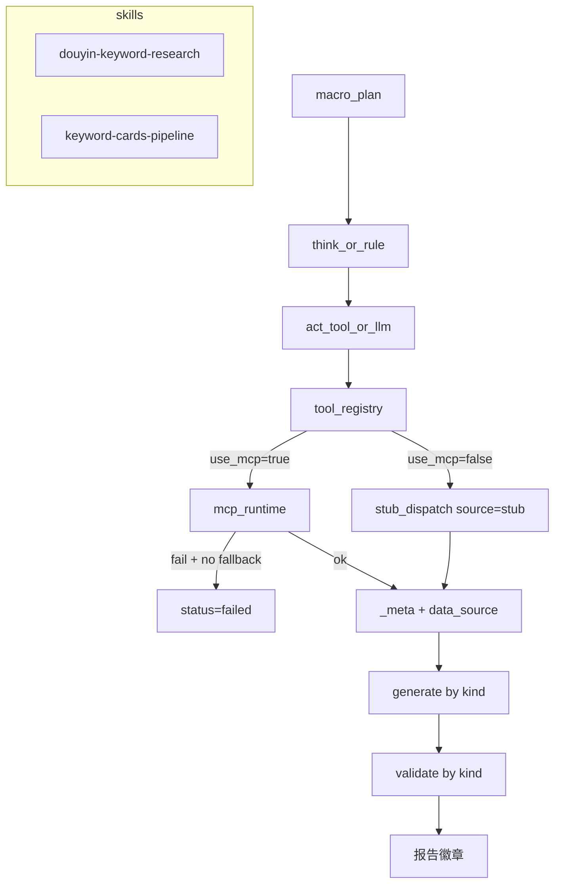

# Spec：MCP 运行时接入 · 第三阶段（M1.3）

> 版本：v0.2 · 2026-07-22（按审查意见修订）  
> 前置：M1.1（Runtime + act 优先 MCP）、M1.2（Registry / API / Dev UI）  
> 审查结论来源：前两阶段审查汇报 + M1.3 Spec v0.1 审查

---

## 0. 一句话目标

把 M1.1/M1.2 已打通的「MCP 运维面」升级为「MCP 驱动业务面」：**工具语义对齐 Skill、结果来源可审计、MCP 失败不可假成功、act 可配置扩展。**

产品态度（必须写死）：

| 场景 | 允许结果 |
|------|----------|
| intentional stub（registry `mcp_tool: null`） | `completed` + **warn** 徽章/alert |
| MCP 调用失败且 `fallback=false` | **`failed`**，禁止生成成功报告 |
| MCP 调用失败且 `fallback=true`（仅 dev） | `completed` + **stub_fallback** 橙徽章 |

---

## 1. 背景与问题（审查摘要）

| ID | 问题 | 等级 | 现状 |
|---|---|---|---|
| R1 | Skill 期望原子工具，Registry 映射到 `keyword_cards_pipeline_tool` | 高 | 数据形状不匹配，quality 失真 |
| R2 | 默认 `MCP_ALLOW_STUB_FALLBACK=true`，MCP 失败仍出“成功报告” | 高 | 运营不可信 |
| R3 | `_meta.source` 未上报告/UI | 中 | 审计链断裂 |
| R4 | `act.py` 硬编码 tool 分支 | 中 | 新工具无法配置接入 |
| R5 | `/api/mcp` 无鉴权 + 每次全量 health | 中 | 不安全、慢 |
| R6 | 测试全局关闭 MCP | 中 | CI 盲区 |
| R7 | `execute.py` 死代码 | 低 | 维护混淆 |

---

## 2. 方案决策：契约对齐（R1）

**采用「A 为主、B-lite 止血」：**

1. **M1.3 必做（A）**：新 Skill `keyword-cards-pipeline`，一等公民调用 `keyword_cards_pipeline_tool`。  
2. **M1.3 同步（B-lite）**：切断  
   `douyin_collect_hot_keywords → keyword_cards_pipeline_tool`；  
   douyin 采集类工具 `mcp_tool: null`（intentional stub）。  
3. **M1.4（B-full）**：open-reverselab 补原子 Douyin MCP 后再接回四步 Skill。

---

## 3. 范围

### 3.1 Must（M1.3 必达）

1. Registry 止血 + intentional stub 语义（`source=stub`）  
2. 新 Skill `keyword-cards-pipeline` 端到端（**运营 + Dev 均可创建**）  
3. 报告 **discriminated union**（`kind`）+ 改 `validate.py`  
4. 创建 API：`seed` 可选 + skill 条件校验；runner/store 字段扩展  
5. `_meta` / `data_source` 上报告与 UI 徽章  
6. MCP 写接口以 **Write-Token** 为主；health 按需  
7. 测试：registry/act/validate/API；opt-in `-m mcp`

### 3.2 Stretch（可降级到 M1.3.e）

- act **完全**去掉硬编码 if（Must 允许 pipeline 先特判，再抽通用层）  
- 运营页只读 MCP 状态  
- 精细化 localhost 快捷（非必须）

### 3.3 Out of Scope

- Tool JSON Schema 动态表单  
- 多租户 / RBAC  
- B-full 原子 Douyin MCP  
- 抖音**线上**真采进 CI（登录态/风控）；真实 Playwright 引擎进 CI 已在 open-reverselab（本地 fixture）

---

## 4. 目标架构



---

## 5. Registry 与 stub 语义

### 5.1 目标 `config/tool_registry.json`

```json
{
  "version": 1,
  "aliases": {
    "douyin_collect_hot_keywords": {
      "mcp_tool": null,
      "description": "intentional stub；禁止映射 pipeline",
      "allow_in_skills": ["douyin-keyword-research"]
    },
    "douyin_expand_suggest_words": {
      "mcp_tool": null,
      "description": "intentional stub",
      "allow_in_skills": ["douyin-keyword-research"]
    },
    "keyword_cards_pipeline": {
      "mcp_tool": "keyword_cards_pipeline_tool",
      "server": "reverse_lab_tools",
      "description": "词卡采集→分析→渲染→可选部署",
      "allow_in_skills": ["keyword-cards-pipeline"],
      "defaults": {
        "collect": true,
        "deploy": false,
        "slugs": ["feide", "oulidiao", "fandidiao"]
      },
      "quality_rules": {
        "ok_true": 0.95,
        "ok_false": 0.1
      }
    },
    "ping": {
      "mcp_tool": "ping",
      "server": "example_tools",
      "allow_in_skills": [],
      "description": "健康检查（不进业务 Skill）"
    }
  }
}
```

规则：

- `allow_in_skills` 为空或不含当前 skill → **拒绝调用**（policy 错误）  
- 未登记 logical tool → **拒绝调用**

### 5.2 `source` 判定（强制）

```text
if not resolved.use_mcp:
    stub_dispatch(...)
    _meta.source = "stub"          # intentional，绝不是 stub_fallback
elif mcp.ok:
    _meta.source = "mcp"
elif settings.mcp_allow_stub_fallback:
    stub_dispatch(...)
    _meta.source = "stub_fallback"
    _meta.mcp_error = ...
else:
    raise / fail_terminal           # 任务 failed
```

---

## 6. Skill 契约

### 6.1 `keyword-cards-pipeline`

`skills/keyword-cards-pipeline/SKILL.md` + `SKILL_PLANS`：

```python
"keyword-cards-pipeline": [
  {"id": "1", "name": "run_pipeline", "label": "词卡流水线",
   "tool": "keyword_cards_pipeline", "status": "pending"},
  {"id": "2", "name": "report", "label": "汇总报告",
   "tool": None, "status": "pending"},
]
```

`init_task` 对该 skill 覆盖：

- `run_timeout_s = 600`
- `quality_threshold = 0.8`
- 进度文案暗示「采集可能数分钟」

### 6.2 `think_or_rule` 分支（写死）

```text
if step.tool:
    action = f"tool:{step.tool}"
elif step.name == "score":
    action = "llm:score"
elif step.name == "report" and skill == "keyword-cards-pipeline":
    action = "report:pipeline"
elif step.name == "report":
    action = "llm:report"
else:
    action = "noop"
```

### 6.3 `douyin-keyword-research`

- 继续运营主路径  
- collect/expand = intentional stub  
- 报告 **必须** alerts：`当前采集步骤为 stub 数据，尚未接入原子 MCP`  
- `data_source.source = stub`

---

## 7. 报告模型：discriminated union（P0）

### 7.1 选定策略

**采用 `kind` 判别联合**，废弃「空 categories 硬塞」方案。

Python（Pydantic）示意：

```python
class DataSourceMeta(BaseModel):
    source: Literal["mcp", "stub", "stub_fallback"]
    tool: str | None = None
    resolved_tool: str | None = None
    mcp_error: str | None = None

class DouyinTaskReport(BaseModel):
    kind: Literal["douyin_keyword"] = "douyin_keyword"
    summary: ReportSummary          # keyword_count...
    tags: list[str]
    alerts: list[AlertItem]
    categories: ReportCategories
    data_source: DataSourceMeta | None = None

class PipelineTaskReport(BaseModel):
    kind: Literal["keyword_cards_pipeline"] = "keyword_cards_pipeline"
    summary: PipelineSummary        # slug_count, ok, deployed
    tags: list[str]
    alerts: list[AlertItem]
    pipeline: PipelinePayload       # urls, generated_paths, artifacts
    data_source: DataSourceMeta | None = None

TaskReport = Annotated[
    DouyinTaskReport | PipelineTaskReport,
    Field(discriminator="kind"),
]
```

前端 `types/task.ts` 同步 union；`ReportTabs` 按 `kind` 分支渲染。

### 7.2 `validate.py`（必改）

```text
if report.kind == "douyin_keyword":
    校验 summary 四字段 + categories 四 list
elif report.kind == "keyword_cards_pipeline":
    校验 summary.ok / slug_count
    校验 pipeline.urls / generated_paths 为 dict
    若 summary.ok is False → validate 失败（或在 generate 前已 fail）
else:
    fail
```

### 7.3 pipeline 工具返回契约

```json
{
  "ok": true,
  "urls": {"feide": "https://www.yoto.work/feide/"},
  "generated_paths": {"feide": "..."},
  "artifacts": {"run_dir": "..."},
  "error": null
}
```

`report:pipeline` 将其映射为 `PipelineTaskReport`；`ok=false` → 任务 `failed`，不进 consolidate 成功态。

---

## 8. 创建 API / State / Runner 字段表

### 8.1 `TaskCreateRequest`

```python
class TaskCreateRequest(BaseModel):
    skill: Literal[
        "douyin-keyword-research",
        "keyword-cards-pipeline",
    ] = "douyin-keyword-research"
    seed: str | None = Field(default=None, max_length=20)
    slugs: list[str] | None = None
    include_video: bool = True
    include_product: bool = True
    date_range_days: Literal[7, 30, 90] = 30
    deploy: bool = False
    collect: bool = True

    @model_validator(mode="after")
    def _check(self):
        if self.skill == "douyin-keyword-research":
            assert self.seed and 1 <= len(self.seed) <= 20
        if self.skill == "keyword-cards-pipeline":
            assert self.slugs and 1 <= len(self.slugs) <= 5
        return self
```

### 8.2 必扩展字段

| 层 | 字段 |
|----|------|
| `AgentState` | `skill`, `slugs`, `deploy`, `collect`（已有 skill；补 slugs/deploy/collect） |
| `TaskRecord` / `TaskDetail` | 同上 + 可选 `seed` |
| `run_task_async` / `create_task_record` | 透传全部创建字段 |
| `chrome_user_data_dir` | **仅环境变量** `DOUYIN_CHROME_USER_DATA_DIR`，不进表单 |

### 8.3 请求示例

抖音（默认）：

```json
{
  "skill": "douyin-keyword-research",
  "seed": "渔具",
  "include_video": true,
  "include_product": true,
  "date_range_days": 30
}
```

词卡 pipeline（Dev）：

```json
{
  "skill": "keyword-cards-pipeline",
  "slugs": ["feide", "oulidiao", "fandidiao"],
  "date_range_days": 30,
  "deploy": false,
  "collect": true
}
```

---

## 9. act / quality

### 9.1 Must 实现路径

1. `tool:*` → registry resolve → allow_in_skills 检查  
2. intentional stub / MCP / fail（见 §5.2）  
3. `quality`：优先 `quality_rules`；否则 `ok==True→0.9` else `0.2`  
4. **删除**对 `count` 的硬依赖  

### 9.2 Stretch

把 collect/expand 硬编码 if 完全收成 `stub_dispatch` 表；Must 阶段允许 pipeline 特判 + douyin 仍走小表。

### 9.3 参数装配 `arg_builders.py`

| logical | 参数 |
|---------|------|
| `keyword_cards_pipeline` | `slugs`, `window_days←date_range_days`, `deploy`, `collect`, `chrome_user_data_dir←env` |
| `douyin_*` | `seed`, `date_range_days` |
| `ping` | `{message:"health"}` |

---

## 10. 可信度与环境

### 10.1 默认值

| `AGENT_ENV` | `MCP_RUNTIME_ENABLED` | `MCP_ALLOW_STUB_FALLBACK` |
|-------------|----------------------|---------------------------|
| `dev`（默认） | true | true |
| `staging` | true | false |
| `prod` | true | **false** |

settings：未显式设置 `MCP_ALLOW_STUB_FALLBACK` 时，由 `AGENT_ENV` 推导。

### 10.2 UI 徽章

- `mcp` → 绿「真实 MCP」  
- `stub` → 灰「模拟数据」  
- `stub_fallback` → 橙「MCP 失败已降级」  

Dev 详情展示完整 `_meta`。

---

## 11. MCP API 硬化

### 11.1 读

- `GET /api/mcp`：config + aliases + **cached** tools；**默认不做 health**  
- `GET /api/mcp?health=1`：按需探测，单 server 超时 8s  
- tools 缓存 TTL=60s；`reload` 清缓存  

### 11.2 写（Token 为主）

适用：`POST /servers`、`DELETE /servers/{id}`、`POST /reload`

```text
if MCP_WRITE_TOKEN 已配置:
    要求 Header X-MCP-Write-Token 完全匹配，否则 403
elif AGENT_ENV == "dev" and MCP_WRITE_TOKEN 未配置:
    允许写，但响应头警告 X-MCP-Write-Warning: unprotected-dev
else:
    403
```

> 修订说明：不再把「localhost」当作唯一放行条件（Vite 反代会导致伪本地）。

---

## 12. 文件变更清单（必改）

### 后端

| 文件 | 变更 |
|------|------|
| `config/tool_registry.json` | 止血 + `allow_in_skills` |
| `src/agent/constants.py` | 新 Skill plan |
| `src/agent/state.py` | `slugs`/`deploy`/`collect` |
| `src/agent/nodes/think.py` | `report:pipeline` 分支 |
| `src/agent/nodes/act.py` | stub/mcp 语义 + quality |
| `src/agent/nodes/generate.py` | 按 skill/`kind` 产出 |
| `src/agent/nodes/validate.py` | 按 `kind` 校验 |
| `src/agent/nodes/init_task.py` | skill 级 timeout/threshold |
| `src/agent/tools/arg_builders.py` | 新增 |
| `src/agent/tools/tool_registry.py` | `allow_in_skills` |
| `src/agent/tools/mcp_runtime.py` | cache；health 可选 |
| `apps/api/.../schemas/tasks.py` | union report + create 校验 |
| `apps/api/.../schemas/mcp.py` | overview 默认无 health |
| `apps/api/.../routers/mcp.py` | token 鉴权；`health` query |
| `apps/api/.../services/report_adapter.py` | 双 kind 映射 |
| `apps/api/.../services/langgraph_runner.py` | 透传字段 |
| `apps/api/.../store/task_store.py` | 存 skill/slugs/... |
| `src/agent/nodes/execute.py` | 删除或标记 deprecated |
| `tests/conftest.py` | 默认关 MCP；`-m mcp` 可开 |

### 前端

| 文件 | 变更 |
|------|------|
| `types/task.ts` | report union + create 字段 |
| `DevNewTaskPage.tsx` | Skill 选择器 |
| `NewTaskPage.tsx` | Skill 选择器（含 pipeline，D5 修订） |
| `ReportTabs` / 详情页 | `kind` 分支 + 徽章 |
| `DevMcpPage.tsx` | health 按钮触发；写操作带 token（若配置） |
| `api/client.ts` | 扩展 create / mcp query |

---

## 13. 实施步骤

### Step 1 — 止血（0.5d）【Must】

1. 改 registry 切断错误映射 + `allow_in_skills`  
2. `AGENT_ENV` 推导 fallback  
3. douyin 报告强制 stub alert；intentional stub → `source=stub`

### Step 2 — 报告 union + pipeline Skill（1.5d）【Must】

1. Pydantic/TS discriminated union + validate  
2. Skill plan + think/act/generate/init_task  
3. runner/store/create API  
4. Dev 新建任务可选 Skill；pipeline 报告页  

### Step 3 — API/UI 硬化（0.5d）【Must】

1. Write-Token 鉴权  
2. health 按需  
3. 来源徽章  

### Step 4 — act 通用化（0.5–1d）【Stretch 可砍】

1. `arg_builders` + stub_dispatch 表  
2. 去掉剩余硬编码 if  

### Step 5 — 测试（0.5d）【Must】

1. registry / validate(kind) / create validator  
2. act：intentional stub vs mcp fail+no fallback  
3. mcp API：无 token → 403（当 token 已配置）  
4. `@pytest.mark.mcp` ping（本地可选）  

**Must 合计约 3.5 人日；含 Stretch 约 4.5 人日。**

---

## 14. 验收标准

### 功能

- [ ] `douyin_collect_hot_keywords` 不再解析到 `keyword_cards_pipeline_tool`
- [ ] intentional stub 的 `_meta.source === "stub"`（不是 `stub_fallback`）
- [ ] Dev / 运营均可创建 `skill=keyword-cards-pipeline`（`deploy=false`）并跑通
- [ ] 成功报告 `kind=keyword_cards_pipeline`，含 `urls`/`generated_paths`，`data_source.source=mcp`
- [ ] `validate` 对两种 `kind` 均可通过
- [ ] MCP 失败 + `fallback=false` → `status=failed`，无成功报告
- [ ] douyin 成功报告含 stub 警告 alert + 灰徽章
- [ ] 运营 `NewTaskPage` **有** Skill 选择器（含 pipeline）
- [ ] `/dev/mcp` 默认不跑 health；按钮才探测
- [ ] 配置了 `MCP_WRITE_TOKEN` 时，无 Header 写操作 → 403

### 质量

- [ ] 现有 graph 测试通过（默认 stub/MCP off）
- [ ] 新增单测通过
- [ ] `pytest -m mcp` 本机可选通过

### 非功能

- [ ] `GET /api/mcp`（无 health）本地 P95 < 300ms
- [ ] 响应/日志无明文密码

---

## 15. 风险与缓解

| 风险 | 缓解 |
|------|------|
| pipeline 超时 | skill 级 `run_timeout_s=600`；默认不 deploy |
| 登录态缺失 | `data_gap` + 提示配置 `DOUYIN_CHROME_USER_DATA_DIR` |
| 双报告前端漏改 | union + ReportTabs 强制 `switch(kind)`，未知 kind 显示错误卡 |
| 通用 act 误调工具 | `allow_in_skills` 白名单 |
| Vite 伪 localhost | 写接口以 Token 为主 |

---

## 16. 决策清单（已定）

| ID | 决策 | 状态 |
|----|------|------|
| D1 | A + B-lite | 已定 |
| D2 | prod/staging fallback=false | 已定 |
| D3 | pipeline 默认 deploy=false | 已定 |
| D4 | 写 API 以 Write-Token 为主 | **已修订** |
| D5 | pipeline 运营 + Dev 均可创建 | **已修订** |
| D6 | 报告用 discriminated union | **新增已定** |
| D7 | intentional stub → completed+warn | **新增已定** |
| D8 | `seed` 按 skill 条件必填 | **新增已定** |

---

## 17. 实施入口

1. Step 1 合入 registry + stub 语义 + alert  
2. Step 2 落地 union report + pipeline Skill  
3. Step 3 鉴权与徽章  
4. Stretch 再做 act 完全通用化  

**本 Spec v0.2 通过后按 Step 1→5 编码；方案分叉不再讨论。**
